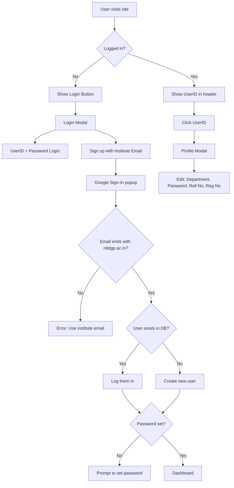

# The Literary Circle - Website Project 📚

Welcome to the official repository for **The Literary Circle Website**! If you are a new inductee of the WebD Domain, **WELCOME TO THE TECH TEAM!** This document is written specifically for you to help you get started from scratch.

Even if you have never coded before or used Git, follow this guide step-by-step, and you will be up and running in no time.

---

## 🚫 1. DO NOT TOUCH (Danger Zone)

These files are critical for the project to run. **Modifying them directly can break the entire website.**

| File/Folder | What it does | Risk if changed | How to safely change |
|-------------|--------------|-----------------|----------------------|
| `package-lock.json` | Locks exact versions of installations. | **HIGH**: The app might crash or behave differently for everyone. | Never edit manually. Run `npm install` to update it. |
| `node_modules/` | Contains thousands of downloaded code packages. | **HIGH**: Your app will stop working instantly. | Never edit manually. Delete usage with `npm uninstall <package>`. |
| `dist/` | The final built website for production. | **LOW**: Your changes will just be overwritten next build. | Do not edit. This is auto-generated. |
| `.git/` | Stores version history. | **EXTREME**: You could lose all project history. | Never touch this hidden folder. |
| `.github/` | Controls **Automated Deployment**. | **HIGH**: You could break the website update process. | Only Tech Heads should modify the workflows here. |

---

## 🛠️ 2. How to Setup the Project (Step-by-Step for Beginners)

Follow these steps exactly. If you get stuck, ask a senior!

### Step 1: Install Required Tools
1.  **Operating System**: Works on **Windows**, **Mac**, or **Linux**. No special setup needed!
2.  **Install VS Code**: This is the editor we use. [Download here](https://code.visualstudio.com/).
3.  **Install Node.js**: This runs our Javascript code. Download the "LTS" version. [Download here](https://nodejs.org/).
4.  **Install Git**: This tracks our code changes. [Download here](https://git-scm.com/downloads). *During installation on Windows, choose "Git Bash" if asked.*

### Step 2: Configure Git (First Time Only)
Open your terminal (or command prompt) and type these commands (replace with your info):
```bash
git config --global user.name "Your Name"
git config --global user.email "your.email@example.com"
```

### Step 3: Clone the Repository
"Cloning" means downloading the project to your computer.
1.  Open VS Code.
2.  Open the Terminal (`Ctrl + ~` or `Cmd + ~`).
3.  Navigate to where you want the folder (e.g., Desktop):
    ```bash
    cd Desktop
    ```
4.  Run the clone command (get the URL from the GitHub "Code" button):
    ```bash
    git clone https://github.com/your-org/lc-website.git
    ```
5.  Go into the folder:
    ```bash
    cd lc-website
    ```
### Step 4: Configure Firebase (Required)

> ⚠️ **This step is mandatory.**  
> The website will **NOT run** and will show a **blank screen** if Firebase is not configured.

---

#### 4.1 Sign in to Firebase
1. Go to the Firebase Console:  
   https://console.firebase.google.com
2. Sign in using your **Google account**

---

#### 4.2 Create a Firebase Project
1. Click **Add project**
2. Enter a project name (e.g. `lc-website`)
3. Disable **Gemini and Google Analytics** (optional)
4. Click **Create project**

---

#### 4.3 Add a Web App
1. Inside the project dashboard, click **Add app** followed by **</> Web**
2. Give the app a nickname (e.g. `lc-website-web`)
3. ❌ Do **NOT** enable Firebase Hosting
4. Click **Register app**
5. Firebase will show a configuration object like this:

```js
const firebaseConfig = {
  apiKey: "AIzaSyB-exampleKey123456",
  authDomain: "lc-website.firebaseapp.com",
  projectId: "lc-website",
  storageBucket: "lc-website.appspot.com",
  messagingSenderId: "123456789012",
  appId: "1:123456789012:web:abc123def456",
  measurementId: "G-ABCDEF1234"
};
```
#### 4.4 Create a `.env` File
The required environment variables are already defined in `.env.example` in the root directory.

1. Copy the example environment file:
   ```bash
   cp .env.example .env
    ```

Open the .env file and replace the placeholder values with
the Firebase configuration shown in the Firebase Console.

⚠️ Do NOT add quotes

### Step 5: Install Dependencies
This downloads all the external code libraries we use (like React, Tailwind).
```bash
npm install
```
*Wait for it to finish. You might see a new `node_modules` folder appear.*

### Step 6: Run the Project Locally
This starts a "local server" so you can see the website on your computer.
```bash
npm run dev
```
You will see a link like `http://localhost:5173`. **Ctrl+Click** (or Cmd+Click) it to open the site in your browser.

---

## 💻 3. Tech Stack & Learning Roadmap

Here is the stack our website is built upen. You need to get familiar with it first. 

### The Stack
*   **React**: A library for building user interfaces.
*   **TypeScript**: JavaScript with "types" (prevents bugs).
*   **Tailwind CSS**: A utility-first CSS framework for styling.
*   **Vite**: The build tool (makes our site run fast).

### 🗺️ Learning Roadmap (For Absolute Beginners)

**Phase 1: The Basics**
*   **HTML/CSS**: Structure and Style.
    *   [HTML Crash Course](https://www.youtube.com/watch?v=qz0aGYrrlhU)
    *   [CSS Crash Course](https://www.youtube.com/watch?v=yfoY53QXEnI)
*   **JavaScript**: The logic.
    *   [JavaScript for Beginners](https://www.youtube.com/watch?v=hdI2bqOjy3c)

*   **NOTE**: Just these crash courses are enough. No need to watch those 8 hour long CSS Tutorials! Watch these videos, code along and move on!

**Phase 2: The Core Tech**
*   **React**: Building components.
    *   [React Course for Beginners](https://www.youtube.com/watch?v=bMknfKXIFA8)
    *   *Mini Project*: Build a simple "To-Do List" app.
*   **Tailwind CSS**: Styling the modern way.
    *   [Tailwind CSS Crash Course](https://www.youtube.com/watch?v=UBOj6rqRAME)
    *   *Mini Project*: Recreate a simple landing page (like Google's homepage).

*   **NOTE**: For building the mini-projects, use the Tech Stack mentioned! This is a must!

**Phase 3: Level Up**
*   **TypeScript**: Safer JavaScript.
    *   [TypeScript for Beginners](https://www.youtube.com/watch?v=d56mG7DezGs)

*   **NOTE**: This is enough. Now you are good enough to add your first feature.

---

## 📂 4. Codebase Structure

Understanding where files live is 90% of the work.

```
/
├── public/              # Static files (images, logos)
│   ├── images/          # Team photos, backgrounds
│   └── logo16.png       # Website favicon
├── src/                 # source code - YOU WORK HERE 99% OF THE TIME
│   ├── components/      # Reusable UI parts
│   │   ├── layout/      # Header, Footer
│   │   └── sections/    # Big page sections (Hero, About, Team)
│   ├── data/            # Data files (easy to edit!)
│   │   ├── siteConfig.ts  # Links, contact info, text
│   │   └── teamMembers.ts # ✨ ADD NEW MEMBERS HERE ✨
│   ├── types/           # TS definitions (types)
│   ├── App.tsx          # Main Page assembly
│   ├── main.tsx         # Entry point (connects React to HTML)
│   └── index.css        # Global styles & Tailwind config
├── index.html           # Main HTML file
└── package.json         # Project settings
```

### Where do I make changes?
*   **Adding a Team Member?** → Go to `src/data/teamMembers.ts`. Just copy an existing block and change the details.
*   **Changing Contact Info?** → Go to `src/data/siteConfig.ts`.
*   **Editing the Navbar?** → `src/components/layout/Header.tsx`.
*   **Changing Styles?** → Most styles are inside the components themselves using Tailwind classes (e.g., `className="text-red-500"`).

---

## 📝 5. Commit & Contribution Rules

**Rules to live by:**
1.  **NEVER push directly to `master`**. The `master` branch is production. If you break it, the site breaks.
2.  **Always create a new branch** for your work.
3.  **Test locally** before saving.

### Workflow: How to contribute correctly

**1. Get the latest code**
Before starting, make sure you have the latest code from everyone else.
```bash
git checkout main
git pull origin main
```

**2. Create a new branch**
Name it descriptively (e.g., `add-new-member`, `fix-navbar-bug`).
```bash
git checkout -b add-naivedyam-bio
```

**3. Make your changes**
Edit the files in VS Code. Save them.

**4. Commit your changes**
"Staging" and "Committing" saves a snapshot of your work.
```bash
git add .
git commit -m "Added Naivedyam's bio and photo"
```
*Note: Write a clear message. "Fixed stuff" is a bad message.*

**5. Push to GitHub**
Send your branch to the cloud.
```bash
git push origin add-naivedyam-bio
```

**6. Make a Pull Request (PR)**
*   Go to the GitHub repository page.
*   You will see a "Compare & pull request" button. Click it.
*   Write a description of what you did.
*   Ask a senior to review it.
*   Once approved, merge it!

---

## 🔐 6. Authentication Workflow

The website uses Firebase Authentication with Google Sign-In for NIT Durgapur students.



### Key Points:
- Only `@nitdgp.ac.in` emails are allowed (btech, mtech, etc.)
- UserID is extracted from email (e.g., `nm.22u10885@btech.nitdgp.ac.in` → `22U10885`)
- First-time users are prompted to set a password
- Users can login with UserID + Password after setting it


## 🛡️ 7. Cloudflare Protection

Our website uses **Cloudflare** for security and performance. Think of it as a security guard + speed booster sitting between visitors and our site.

### Default Features (Always Active)

| Feature | What It Does |
|---------|--------------|
| **DDoS Protection** | DDoS (Distributed Denial of Service) attacks try to crash websites by flooding them with millions of fake requests. Cloudflare automatically detects these attacks and blocks the malicious traffic before it reaches our server. This runs 24/7 with no action needed from us. |
| **Global CDN** | CDN stands for Content Delivery Network. Cloudflare copies our website to 300+ servers across the world. When someone visits from India, they get the site from Mumbai/Chennai servers. Someone from the US gets it from American servers. This means faster loading times for everyone, no matter where they are. |
| **SSL/TLS Encryption** | This is the padlock you see in your browser's address bar. All data between visitors and our site is encrypted, so hackers can't intercept passwords, form submissions, or any other data. We use TLS 1.3, the newest and most secure version. |
| **Web Application Firewall** | The firewall analyzes every request to our site. It blocks known hackers, malicious bots, SQL injection attempts, and other common attacks. It uses a database of known threats that Cloudflare updates continuously. |

### Custom Features (Enabled by Us)

| Feature | What It Does |
|---------|--------------|
| **Bot Fight Mode** | Many bots crawl the internet trying to scrape content, spam forms, or find vulnerabilities. Bot Fight Mode identifies and blocks these automated visitors while allowing legitimate bots like Google Search to continue crawling. |
| **AI Labyrinth** | This is a clever trap for AI scrapers. Cloudflare adds invisible honeypot links to our pages. Real visitors never see them, but AI bots that ignore our robots.txt rules follow these links and get trapped in an endless maze of AI-generated fake content. They waste their resources while our real content stays protected. |
| **Browser Integrity Check** | Some attackers use headless browsers or modified browsers to attack sites. This feature checks if the visitor's browser is legitimate by analyzing HTTP headers. Suspicious browsers are challenged or blocked. |
| **Auto Minify** | Our JavaScript, CSS, and HTML files contain spaces, comments, and formatting for readability. Auto Minify removes all unnecessary characters, making files smaller and faster to download. This happens automatically on every page load. |
| **Brotli Compression** | Before sending files to visitors, Cloudflare compresses them using Brotli (better than the older gzip). A 100KB file might become 25KB. Smaller files = faster page loads, especially on slow mobile connections. |
| **Early Hints (103)** | Normally, browsers wait for the full HTML before downloading CSS/JS. Early Hints sends a "103" response telling browsers which files to start downloading immediately, before the HTML even arrives. This shaves off precious milliseconds from load time. |
| **Speed Brain** | When a visitor hovers over a link or is likely to click something, Speed Brain prefetches the next page in the background. By the time they click, the page is already partially loaded to make navigation feel instant. |
| **0-RTT Connection** | When a returning visitor connects, normally there's a TLS handshake (back-and-forth to establish encryption). 0-RTT allows their first request to be sent before the handshake finishes, making repeat visits faster. |
| **HTTP/3 (QUIC)** | The newest internet protocol. It's faster than HTTP/2, especially on unstable mobile connections. If a visitor's browser supports it (Chrome, Firefox, Edge do), they automatically get the faster connection. |
| **Always Online** | If GitHub Pages (our hosting) ever goes down, Cloudflare will serve a cached version of our site instead of showing an error. Visitors might see slightly old content, but the site stays up. |

### Emergency: Site Under Attack

If the website is extremely slow or showing errors and you suspect an attack:

**Step 1: Enable "I'm Under Attack Mode"**
1. Login to [Cloudflare Dashboard](https://dash.cloudflare.com)
2. Select `lcnitd.co.in`
3. Go to **Security** → **Settings**
4. Toggle **"I'm Under Attack Mode"** ON

> **Warning:** This shows a 5-second JavaScript challenge to ALL visitors. Only enable during actual attacks!

**Step 2: Monitor**
- Check **Security** → **Analytics** to see blocked threats
- Wait for attack traffic to subside

**Step 3: Disable When Safe**
- Once traffic normalizes, turn OFF "Under Attack Mode"
- Normal visitors won't see the challenge anymore

**Contact:** Tech Heads have Cloudflare dashboard access.

---
*Maintained by The Literary Circle*
