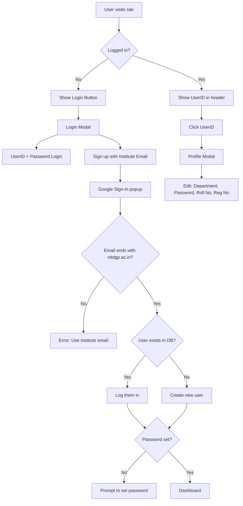

# The Literary Circle - Website Project 📚

Welcome to the official repository for **The Literary Circle Website**! If you are a new inductee of the WebD Domain, **WELCOME TO THE TECH TEAM!** This document is written specifically for you to help you get started from scratch.

Even if you have never coded before or used Git, follow this guide step-by-step, and you will be up and running in no time.

---

## 1. DO NOT TOUCH (Danger Zone)

These files are critical for the project to run. **Modifying them directly can break the entire website.**

| File/Folder | What it does | Risk if changed | How to safely change |
|-------------|--------------|-----------------|----------------------|
| `package-lock.json` | Locks exact versions of installations. | **HIGH**: The app might crash or behave differently for everyone. | Never edit manually. Run `npm install` to update it. |
| `node_modules/` | Contains thousands of downloaded code packages. | **HIGH**: Your app will stop working instantly. | Never edit manually. Delete usage with `npm uninstall <package>`. |
| `dist/` | The final built website for production. | **LOW**: Your changes will just be overwritten next build. | Do not edit. This is auto-generated. |
| `.git/` | Stores version history. | **EXTREME**: You could lose all project history. | Never touch this hidden folder. |
| `.github/` | Controls **Automated Deployment**. | **HIGH**: You could break the website update process. | Only Tech Heads should modify the workflows here. |

---

## 2. How to Setup the Project (Step-by-Step for Beginners)

Follow these steps exactly. If you get stuck, ask a senior!

### Step 1: Install Required Tools
1.  **Operating System**: Works on **Windows**, **Mac**, or **Linux**. No special setup needed!
2.  **Install VS Code**: This is the editor we use. [Download here](https://code.visualstudio.com/).
3.  **Install Node.js**: This runs our Javascript code. Download the "LTS" version. [Download here](https://nodejs.org/).
4.  **Install Git**: This tracks our code changes. [Download here](https://git-scm.com/downloads). *During installation on Windows, choose "Git Bash" if asked.*

### Step 2: Configure Git (First Time Only)
Open your terminal (or command prompt) and type these commands (replace with your info):
```bash
git config --global user.name "Your Name"
git config --global user.email "your.email@example.com"
```

### Step 3: Clone the Repository
"Cloning" means downloading the project to your computer.
1.  Open VS Code.
2.  Open the Terminal (`Ctrl + ~` or `Cmd + ~`).
3.  Navigate to where you want the folder (e.g., Desktop):
    ```bash
    cd Desktop
    ```
4.  Run the clone command (get the URL from the GitHub "Code" button):
    ```bash
    git clone https://github.com/your-org/lc-website.git
    ```
5.  Go into the folder:
    ```bash
    cd lc-website
    ```
### Step 4: Configure Firebase (Required)

> ⚠️ **This step is mandatory.**  
> The website will **NOT run** and will show a **blank screen** if Firebase is not configured.

---

#### 4.1 Sign in to Firebase
1. Go to the Firebase Console:  
   https://console.firebase.google.com
2. Sign in using your **Google account**

---

#### 4.2 Create a Firebase Project
1. Click **Add project**
2. Enter a project name (e.g. `lc-website`)
3. Disable **Gemini and Google Analytics** (optional)
4. Click **Create project**

---

#### 4.3 Add a Web App
1. Inside the project dashboard, click **Add app** followed by **</> Web**
2. Give the app a nickname (e.g. `lc-website-web`)
3. ❌ Do **NOT** enable Firebase Hosting
4. Click **Register app**
5. Firebase will show a configuration object like this:

```js
const firebaseConfig = {
  apiKey: "AIzaSyB-exampleKey123456",
  authDomain: "lc-website.firebaseapp.com",
  projectId: "lc-website",
  storageBucket: "lc-website.appspot.com",
  messagingSenderId: "123456789012",
  appId: "1:123456789012:web:abc123def456",
  measurementId: "G-ABCDEF1234"
};
```
#### 4.4 Create a `.env` File
The required environment variables are already defined in `.env.example` in the root directory.

1. Copy the example environment file:
   ```bash
   cp .env.example .env
    ```

Open the .env file and replace the placeholder values with
the Firebase configuration shown in the Firebase Console.

⚠️ Do NOT add quotes

### Step 5: Install Dependencies
This downloads all the external code libraries we use (like React, Tailwind).
```bash
npm install
```
*Wait for it to finish. You might see a new `node_modules` folder appear.*

### Step 6: Run the Project Locally
This starts a "local server" so you can see the website on your computer.
```bash
npm run dev
```
You will see a link like `http://localhost:5173`. **Ctrl+Click** (or Cmd+Click) it to open the site in your browser.

---

## 3. Tech Stack & Learning Roadmap

Here is the stack our website is built upen. You need to get familiar with it first. 

### The Stack
*   **React**: A library for building user interfaces.
*   **TypeScript**: JavaScript with "types" (prevents bugs).
*   **Tailwind CSS**: A utility-first CSS framework for styling.
*   **Vite**: The build tool (makes our site run fast).

### Learning Roadmap (For Absolute Beginners)

**Phase 1: The Basics**
*   **HTML/CSS**: Structure and Style.
    *   [HTML Crash Course](https://www.youtube.com/watch?v=qz0aGYrrlhU)
    *   [CSS Crash Course](https://www.youtube.com/watch?v=yfoY53QXEnI)
*   **JavaScript**: The logic.
    *   [JavaScript for Beginners](https://www.youtube.com/watch?v=hdI2bqOjy3c)

*   **NOTE**: Just these crash courses are enough. No need to watch those 8 hour long CSS Tutorials! Watch these videos, code along and move on!

**Phase 2: The Core Tech**
*   **React**: Building components.
    *   [React Course for Beginners](https://www.youtube.com/watch?v=bMknfKXIFA8)
    *   *Mini Project*: Build a simple "To-Do List" app.
*   **Tailwind CSS**: Styling the modern way.
    *   [Tailwind CSS Crash Course](https://www.youtube.com/watch?v=UBOj6rqRAME)
    *   *Mini Project*: Recreate a simple landing page (like Google's homepage).

*   **NOTE**: For building the mini-projects, use the Tech Stack mentioned! This is a must!

**Phase 3: Level Up**
*   **TypeScript**: Safer JavaScript.
    *   [TypeScript for Beginners (Hindi) – CodeWithHarry](https://youtu.be/d56mG7DezGs?si=wgjHYUw2Cw6tnglx)
    *   [TypeScript for Beginners (English) – FreeCodeCamp](https://youtu.be/30LWjhZzg50?si=m3kM3NhrLMVZ1Uho)


*   **NOTE**: This is enough. Now you are good enough to add your first feature.
*   **Phase 4: Backend & Infrastructure Basics**

*   **Firebase (Backend as a Service)**
    Firebase is used for authentication, database, and security rules in this project.  
    Focus especially on **Firestore**.

    **Recommended Resources:**
    *   📘 Firebase Official Documentation  
        https://firebase.google.com/docs
    *   📘 Firestore Official Guide  
        https://firebase.google.com/docs/firestore
    *   🎥 Firebase in 100 Seconds – Fireship  
        https://www.youtube.com/watch?v=vAoB4VbhRzM
    *   🎥 Firebase Full Course (Beginner Friendly) – Net Ninja  
        https://www.youtube.com/playlist?list=PL4cUxeGkcC9jERUGvbudErNCeSZHWUVlb

    **What to learn:**
    * Firestore collections & documents
    * CRUD operations
    * Firebase Authentication
    * Basic security rules

*   **Cloudflare (Security & Performance Layer)**
    Cloudflare is used to protect and accelerate the website before traffic reaches GitHub Pages.

    **Recommended Resources:**
    *   📘 Cloudflare Learning Center  
        https://www.cloudflare.com/learning/
    *   🌐 What is Cloudflare?  
        https://www.cloudflare.com/learning/what-is-cloudflare/
    *   🔐 Cloudflare Security Basics  
        https://www.cloudflare.com/learning/security/
    *   🎥 Cloudflare Explained – ByteByteGo  
        https://www.youtube.com/watch?v=0eRrXq7xJxA

    **What to understand:**
    * DNS & CDN basics
    * DDoS protection
    * Web Application Firewall (WAF)


---

## 4. System Architecture


Our application connects several services to deliver a secure and fast experience:

*   **Users** access the site via `lcnitd.co.in`.
*   **GoDaddy** resolves the domain to Cloudflare's servers.
*   **Cloudflare** acts as a shield, providing DDoS protection and CDN caching before requests reach our host.
*   **GitHub Pages** hosts our static React frontend bundle.
*   **React App** runs in the user's browser, handling the UI and logic.
*   **Firebase** provides backend services:
    *   **App Check** verifies that requests come from our legitimate app.
    *   **Firestore** stores user data and authentication state.

---

## 📂 5. Codebase Structure


```
├── .env.example                 # Example environment variables file
├── .gitignore                   # Git ignore rules
├── .npmrc                       # NPM configuration
├── README.md                    # Project documentation and instructions
├── index.html                   # Main HTML entry point
├── package-lock.json            # NPM lock file for dependencies
├── package.json                 # Project metadata, scripts, and dependencies
├── pnpm-lock.yaml               # PNPM lock file for dependencies
├── postcss.config.js            # PostCSS configuration for styling
├── tsconfig.app.json            # TypeScript configuration for the app
├── tsconfig.json                # Main TypeScript configuration
├── tsconfig.node.json           # TypeScript configuration for Node.js
├── vite.config.ts               # Vite build tool configuration
├── .github/                     # GitHub-specific configurations
│   └── workflows/               # CI/CD workflow definitions
│       └── pages.yaml           # Workflow for deploying to GitHub Pages
├── public/                      # Static files served directly (images, logos, etc.)
│   ├── apple-touch-icon.png              # Apple touch icon for web app
│   ├── empty_wooden_bookshelf_bg.png     # Background image for bookshelf
│   ├── logo16.png                        # Small logo icon
│   ├── robots.txt                        # Robots exclusion standard file
│   ├── sitemap.xml                       # XML sitemap for SEO
│   ├── system_architecture.png           # Diagram of system architecture
│   ├── images/                           # General images for the site
│   │   ├── blog/                                 # Images related to blog posts
│   │   │   ├── blog-img1.jpg                             # Blog image 1
│   │   │   ├── blog-img2.jpg                             # Blog image 2
│   │   │   ├── blog-img3.jpg                             # Blog image 3
│   │   │   ├── comment-img1.png                          # Comment image 1
│   │   │   ├── comment-img2.png                          # Comment image 2
│   │   │   └── single-blog.jpg                           # Single blog post image
│   │   ├── dejavu/ # Images for DejaVu section (yearly)
│   │   │   ├── 2013.png                          # 2013 DejaVu image
│   │   │   ├── 2014.png                          # 2014 DejaVu image
│   │   │   ├── 2015.png                          # 2015 DejaVu image
│   │   │   ├── 2016.png                          # 2016 DejaVu image
│   │   │   └── 2017.png                          # 2017 DejaVu image
│   │   ├── team/                             # Team member images
│   │   └── slider/                           # Slider/carousel images
│   │       ├── 201.jpg                               # Slider image 1
│   │       ├── 91.jpg                                # Slider image 2
│   │       └── a8.jpg                                # Slider image 3
│   └── pdfs/                             # PDF files directory
│      └── dejavu/                               # DejaVu-related PDFs
│           ├── 2013_compressed.pdf                   # Dejavu pdf 2013
│           ├── 2014_compressed.pdf                   # Dejavu pdf 2014
│           ├── 2015_compressed.pdf                   # Dejavu pdf 2015
│           ├── 2016_compressed.pdf                   # Dejavu pdf 2016
│           └── 2017_compressed.pdf                   # Dejavu pdf 2017
│
└── src/                                  # Source code - YOU WORK HERE 99% OF THE TIME
    ├── App.tsx                                   # Main app component assembly
    ├── SEO.tsx                                   # Component for handling SEO metadata
    ├── index.css                                 # Global styles and Tailwind CSS configuration
    ├── main.tsx                                  # Entry point (connects React to HTML)
    ├── assets/                                   # Images and audio assets used in the app
    │   ├── auditions/                                    # Assets for auditions section
    │   │   ├── auditions-bg-poster.webp                          # Auditions background poster
    │   │   ├── auditions-bg.webm                                 # Auditions background video
    │   │   ├── gun.webp                                          # Gun image
    │   │   └── mysterious-man.webp                               # Mysterious man image
    │   └── sounds/                                       # Audio files
    │       └── gunshot.mp3                                       # Gunshot sound effect
    ├── components/                               # Reusable UI components
    │   ├── alumni/                                       # Components for alumni features
    │   │   ├── AlumniCard.tsx                                    # Card for displaying alumni
    │   │   ├── AlumniDetailsModal.tsx                            # Modal for alumni details
    │   │   ├── AlumniFormModal.tsx                               # Modal for alumni form
    │   │   └── index.ts                                          # Export index for alumni components
    │   ├── auditions/                                    # Components for auditions
    │   │   ├── AuditionResponse.tsx                              # Response component for auditions
    │   │   ├── QuestionsList.tsx                                 # List of questions
    │   │   └── ResponseLibrary.tsx                               # Library of responses
    │   ├── auth/                                         # Authentication-related components
    │   │   ├── LoginModal.tsx                                    # Login modal
    │   │   ├── SetPasswordModal.tsx                              # Set password modal
    │   │   ├── UserProfileModal.tsx                              # User profile modal
    │   │   └── index.ts                                          # Export index for auth components
    │   ├── common/                                       # Common utility components
    │   │   ├── EditableText.tsx                                  # Editable text component
    │   │   └── index.ts                                          # Export index for common components
    │   ├── dejavu/                                       # Components for DejaVu section
    │   │   ├── Book.tsx                                          # Book component
    │   │   ├── Bookshelf.tsx                                     # Bookshelf display
    │   │   ├── DejaVuSection.tsx                                 # DejaVu section wrapper
    │   │   └── PDFViewerModal.tsx                                # Modal for viewing PDFs
    │   ├── layout/                                       # Layout components like header and footer
    │   │   ├── Footer.tsx                                        # Footer component
    │   │   ├── Header.tsx                                        # Header component
    │   │   └── index.ts                                          # Export index for layout
    │   ├── members/                                      # Components for members
    │   │   ├── MemberCard.tsx                                    # Member card
    │   │   ├── MemberDetailsModal.tsx                            # Member details modal
    │   │   └── index.ts                                          # Export index for members
    │   └── sections/                                     # Sectional components for pages
    │       ├── AboutSection.tsx                                  # About section
    │       ├── HeroSection.tsx                                   # Hero/banner section
    │       ├── TeamMemberCard.tsx                                # Team member card
    │       ├── TeamSection.tsx                                   # Team section
    │       └── index.ts                                          # Export index for sections
    ├── context/                                  # React context providers
    │   ├── AuthContext.tsx                               # Authentication context
    │   └── index.ts                                      # Export index for contexts
    ├── data/                                     # Data files (easy to edit!)
    │   ├── siteConfig.ts                                 # Site links, contact info, text content
    │   └── teamMembers.ts                                # ✨ ADD NEW MEMBERS HERE ✨
    ├── firebase/                                 # Firebase backend integration
    │   ├── config.ts                                     # Firebase configuration
    │   ├── index.ts                                      # Firebase exports
    │   └── migrateTeam.ts                                # Script to migrate team data
    ├── pages/                                    # Page components
    │   ├── AlumniPage.tsx                                # Alumni page
    │   ├── AuditionsPage.tsx                             # Auditions page
    │   ├── DejaVuPage.tsx                                # DejaVu page
    │   ├── HomePage.tsx                                  # Home page
    │   ├── MembersDashboardPage.tsx                      # Members dashboard
    │   └── index.ts                                      # Export index for pages
    ├── services/                                 # Service functions for API interactions
    │   └── alumniService.ts                              # Functions to manage alumni data
    ├── types/                                    # TypeScript type definitions
    │   ├── alumni.ts                                     # Types for alumni
    │   └── team.ts                                       # Types for team members
    └── utils/                                    # Utility functions
        ├── authUtils.ts                                  # Authentication utilities
        └── index.ts                                      # Export index for utils
/
├── public/                  
│   This folder contains files that are served directly by the browser.
│   Nothing here goes through React or Vite processing.
│
│   ├── images/              
│   All general images used across the site, such as blog visuals,
│   team photos, sliders, and other static graphics. 
│
│   ├── pdfs/                
│   Stores DejaVu magazine PDFs, organised year-wise for easy access.
|   |   ├── 2013/
         spring 2013 ,literary cum festival
|   |   ├── 2014/
|       creative writings and literary prices by club members.
|   |   ├── 2015/
|           collection of poems,stories,and articles by the club
|   |   ├── 2016/
|        annua magazine featuring members literary works.
|   |   ├── 2017/
|        stories,poems,and creative articles by the club.
│
│   ├── logo16.png           
│   The site’s favicon and main branding icon.
│
│   └── robots.txt           
│   Helps search engines understand how to crawl the website.Robots.txt allowing all user-agents and linking to the site sitemap.
│
├── src/                     
│   This is where most of the development happens.
│   It contains all React components, logic, and stylingand contains various sub folders in it .
│
│   ├── components/          
│   Reusable building blocks that are used across different pages.
│
│   │   ├── layout/          
│   Common layout elements like the header, footer, and navigation bar.
|     |   |  ├── header/
            Responsive React header with navigation, mobile menu, login/profile modals, password setup, and access control for members.
|     |  ├── footer/
          Editable React footer component fetching, displaying, and allowing admin users to update site info and social links.
|     |   ├── index/
           Exports Header and Footer components for site layout and navigation. 
│
│   │   ├── sections/        
│   Larger page sections such as Hero, About, Team, etc.
|               ├─aboutsection/
|                 A dynamic, Firestore-backed “About Us” section with animated display and admin-only inline editing, version tracking, and live content updates.
|               ├─herosection/
|                 A full-screen, animated hero component with Firestore-backed content and admin-only inline editing for headline and tagline text.
|               ├─teammembercard/
│                An animated profile card for team members that flips on hover to reveal a secondary image, role, and social media links.
|               ├─teamsection/
|                A Firestore-backed, animated team showcase section that displays members by year with editable titles and integrated TeamMemberCard profiles.
|                ├─index/
|                 Central export file that consolidates all main landing page components—Hero, About, TeamSection, and TeamMemberCard—for easy imports.
|                ├─SEO/
|                A reusable component that manages page metadata and structured data using react-helmet-async for optimized SEO and social sharing.
│   |  ├── alumni/          
│   Components related to displaying alumni information and profiles.
|              ├── alumni card/
              An animated, role-aware profile card component that displays alumni details with conditional contact access, admin edit/delete controls, and interactive social links.
│              ├── alumnidetailsmodal/
|               An animated modal component that presents complete alumni profiles with photo, role, contact links, and record metadata in a polished, accessible layout.
|              ├── alumniform modal/
|              A secure, role-based modal form for adding or editing alumni records with validation, Google Drive image handling, and service-backed persistence.
|              ├── index/
|              Central export file that aggregates and re-exports all alumni-related UI components for clean and simplified imports. 
              
│   │   ├── members/         
│   UI elements for members, including cards, modals, and details.
|                ├── membercard/
|                  Animated profile card displaying a member’s name and role, with special highlighting for LCite members and click interaction.
|                 ├── memberdetailsmodal/
|                  Modal to view a member’s profile details and promote/demote their role (Student ↔ LCite) with Firebase updates.
|                  ├── index/
|                  Exports member UI components for listing members and viewing/updating detailed member profiles via modal.
│
│   │   ├── auditions/       
│   Components that handle audition forms, steps, and user flows.
|                  ├── auditionresponse/ 
|                  Interactive, animated audition questionnaire that fetches questions from Firestore, records user responses with skip/submit flow, tracks completion       |                   status, and delivers a cinematic UX with sound and motion effects.
|                  ├── Questionslists/ 
|                  A real-time, Firestore-backed admin interface to view, add, edit, and delete audition questions with role-based permissions, batch-syncing updates to all |                   user responses, and a cinematic “confidential dossier” themed UI with animations.
|                   ├── ResponseLibrary/ 
                    A real-time Firestore-backed interface to add, edit, review, and securely manage audition questions with role-based controls.
│   │   ├── auth/            
│   Authentication-related components like login, signup, and profiles.
|                ├── Loginmodal/
|                 An animated authentication modal supporting User ID/password and institute Google login with loading states, error handling, and intruder access alerts.
|                ├── Setpasswordmodal/
|                An animated modal prompting users to securely set or skip setting their account password with validation and error handling.
|                ├── userprofilemodal/
|                An animated modal for viewing and updating user details (academic info, password) with save feedback and logout support.
|                ├── index/
|                 Exports login, password setup, and user profile management modals for authentication and account handling.
│
│   │   └── dejavu/          
│   Components for browsing and viewing DejaVu magazines and PDFs.
|             └── book/
|              Animated book component with 3D hover effects, displaying a cover image and handling click interactions.
|              └── BookShelf/
|              Responsive bookshelf layout component that positions and animates book items with calibrated mobile offsets and a background shelf image.
|              └── DejaVuSection/
|               Animated “Déjà Vu” section header with an ornate vintage plaque design for the archives page.
|             └── PDFviewermodal/
|               Responsive modal PDF viewer with animated transitions, mobile-friendly fallback, and download support.
│
│   ├── pages/               
│   Page-level components that are connected to routes in the app.
|            ├── alumnipage/
|               A dynamic, Firestore-powered page displaying alumni by year with expandable sections, add/edit/delete functionality, privacy alerts, and modals for detailed                 view and form submissions.
|            ├── auditionspage/
|            An interactive, video-backed page for Literary Circle auditions, featuring animated title effects, user authentication, profile completion checks, and dynamic |            question/response workflows for eligible students.
|            ├── DejaVuPage/
|             Displays a digital bookshelf of Déjà Vu yearbooks with interactive book previews and PDF viewing modal.
|            ├── HomePage/
|              Renders the Literary Circle homepage with Hero, About, Team sections, SEO, Header/Footer, and an Auditions promo modal for new students.
|            ├── Membersdasboardpage/
|              Admin dashboard to view, manage, and categorize all Literary Circle members by year, with member details modal, section toggles, access control, and loading  |              states.
|            ├── index/
|             Central export hub for all major site pages including Home, Auditions, Members Dashboard, Déjà Vu, and Alumni pages.
│
│   ├── data/                
│   Simple data files used to store content that doesn’t change often.
|           ├── siteConfig/   
|             Central configuration for The Literary Circle website, including name, description, navigation, social links, contact info, and about content.
|            ├── teamMember/
|              An array of TeamMember objects with complete profile details, plus helper functions to filter members by year (FinalYear, ThirdYear, SecondYear).
│
│   ├── context/             
│   Global state management using React Context
│   (for example, authentication state).
|          ├── Authcontext/ 
|          React context managing Firebase authentication, Google sign-in, credential login, user state, profile updates, password setup, and session persistence.
|          ├── index/ 
│          Re-exports AuthProvider, useAuth, and UserData type for centralized authentication handling.
│   ├── services/            
│   Handles communication with external services like Firebase
│   or other backend APIs.
|         ├── alumniservices/
|         A Firestore-backed service providing functions to fetch, add, update, and delete alumni records organized by graduating year.  
│
│  ├── utils/               
│   Helper functions that are used in multiple places in the app.
|           ├── authutils/ 
|           Utility functions to validate institute emails, extract user IDs, and generate standardized NIT Durgapur email addresses based on name, registration number, and |            department.
|           ├── index/
|             Central export file that re-exports all authentication-related utility functions for streamlined imports.
│
│   ├── types/               
│   Central place for TypeScript types and interfaces.
|        ├── alumni/
|         TypeScript interface defining the structure of an alumni record, including personal info, contact details, presidency status, and audit metadata.
|        ├── team/
|        Defines TeamMember and SocialLinks interfaces for team profiles, including name, role, year, images, social media, and optional last edited info.
|   ├── firebase/
| Firebase configuration & helpers
|           ├── config/
|             Firebase initialized with Firestore, Auth, Analytics, and App Check (ReCaptcha v3) using environment variables.
|            ├── migrateteam/
|            Migrates predefined team members to Firestore in batch and marks migration as complete if not already done.
|            ├── index/
|            Re-exports Firebase app, analytics, Firestore database, and authentication instances from the config file.
|
 
│
│   ├── assets/              
│   Images and media that are imported directly into components.
│
│   ├── App.tsx              
|   Main App component setting up routing, authentication context, and migrating team members to Firestore on load.
│
│   ├── main.tsx             
│   Entry point rendering the React app with StrictMode and HelmetProvider, importing global CSS.
│
│   └── index.css            
│   Global CSS setup with Google Fonts, Tailwind integration, custom theme colors, fonts, animations, and utility classes for typography, buttons, and components.
│
├── .github/                 
│   GitHub-related configuration such as CI workflows and actions.
│
├── .env.example             
│   Environment variables for Firebase configuration in the Vite project.
│
├── index.html               
│   HTML template for The Literary Circle website with meta tags, favicon, Google Fonts, and root div for React app.
│
├── vite.config.ts           
│   Vite configuration with React plugin enabled and base path set to root.
│
├── tsconfig*.json           
│   TypeScript configuration targeting ES2022 with React JSX, strict type checking, bundler-friendly module resolution, and linting rules enabled for the src folder.
│
├── package.json             
│   Project setup using Vite with React, TypeScript, TailwindCSS, Firebase, Framer Motion, and various dev tools for linting, building, and previewing.
│
└── README.md                
│   Project documentation, setup instructions, and codebase overview.

```

### Where do I make changes?
*   **Adding a Team Member?** → Go to `src/data/teamMembers.ts`. Just copy an existing block and change the details.
*   **Changing Contact Info?** → Go to `src/data/siteConfig.ts`.
*   **Editing the Navbar?** → `src/components/layout/Header.tsx`.
*   **Changing Styles?** → Most styles are inside the components themselves using Tailwind classes (e.g., `className="text-red-500"`).

---

## 6. Commit & Contribution Rules

**Rules to live by:**
1.  **NEVER push directly to `master`**. The `master` branch is production. If you break it, the site breaks.
2.  **Always create a new branch** for your work.
3.  **Test locally** before saving.

### Workflow: How to contribute correctly

**1. Get the latest code**
Before starting, make sure you have the latest code from everyone else.
```bash
git checkout main
git pull origin main
```

**2. Create a new branch**
Name it descriptively (e.g., `add-new-member`, `fix-navbar-bug`).
```bash
git checkout -b add-naivedyam-bio
```

**3. Make your changes**
Edit the files in VS Code. Save them.

**4. Commit your changes**
"Staging" and "Committing" saves a snapshot of your work.
```bash
git add .
git commit -m "Added Naivedyam's bio and photo"
```
*Note: Write a clear message. "Fixed stuff" is a bad message.*

**5. Push to GitHub**
Send your branch to the cloud.
```bash
git push origin add-naivedyam-bio
```

**6. Make a Pull Request (PR)**
*   Go to the GitHub repository page.
*   You will see a "Compare & pull request" button. Click it.
*   Write a description of what you did.
*   Ask a senior to review it.
*   Once approved, merge it!

---

## 7. Authentication Workflow

The website uses Firebase Authentication with Google Sign-In for NIT Durgapur students.



### Key Points:
- Only `@nitdgp.ac.in` emails are allowed (btech, mtech, etc.)
- UserID is extracted from email (e.g., `nm.22u10885@btech.nitdgp.ac.in` → `22U10885`)
- First-time users are prompted to set a password
- Users can login with UserID + Password after setting it


## 8. Cloudflare Protection

Our website uses **Cloudflare** for security and performance. Think of it as a security guard + speed booster sitting between visitors and our site.

### Default Features (Always Active)

| Feature | What It Does |
|---------|--------------|
| **DDoS Protection** | DDoS (Distributed Denial of Service) attacks try to crash websites by flooding them with millions of fake requests. Cloudflare automatically detects these attacks and blocks the malicious traffic before it reaches our server. This runs 24/7 with no action needed from us. |
| **Global CDN** | CDN stands for Content Delivery Network. Cloudflare copies our website to 300+ servers across the world. When someone visits from India, they get the site from Mumbai/Chennai servers. Someone from the US gets it from American servers. This means faster loading times for everyone, no matter where they are. |
| **SSL/TLS Encryption** | This is the padlock you see in your browser's address bar. All data between visitors and our site is encrypted, so hackers can't intercept passwords, form submissions, or any other data. We use TLS 1.3, the newest and most secure version. |
| **Web Application Firewall** | The firewall analyzes every request to our site. It blocks known hackers, malicious bots, SQL injection attempts, and other common attacks. It uses a database of known threats that Cloudflare updates continuously. |

### Custom Features (Enabled by Us)

| Feature | What It Does |
|---------|--------------|
| **Bot Fight Mode** | Many bots crawl the internet trying to scrape content, spam forms, or find vulnerabilities. Bot Fight Mode identifies and blocks these automated visitors while allowing legitimate bots like Google Search to continue crawling. |
| **AI Labyrinth** | This is a clever trap for AI scrapers. Cloudflare adds invisible honeypot links to our pages. Real visitors never see them, but AI bots that ignore our robots.txt rules follow these links and get trapped in an endless maze of AI-generated fake content. They waste their resources while our real content stays protected. |
| **Browser Integrity Check** | Some attackers use headless browsers or modified browsers to attack sites. This feature checks if the visitor's browser is legitimate by analyzing HTTP headers. Suspicious browsers are challenged or blocked. |
| **Auto Minify** | Our JavaScript, CSS, and HTML files contain spaces, comments, and formatting for readability. Auto Minify removes all unnecessary characters, making files smaller and faster to download. This happens automatically on every page load. |
| **Brotli Compression** | Before sending files to visitors, Cloudflare compresses them using Brotli (better than the older gzip). A 100KB file might become 25KB. Smaller files = faster page loads, especially on slow mobile connections. |
| **Early Hints (103)** | Normally, browsers wait for the full HTML before downloading CSS/JS. Early Hints sends a "103" response telling browsers which files to start downloading immediately, before the HTML even arrives. This shaves off precious milliseconds from load time. |
| **Speed Brain** | When a visitor hovers over a link or is likely to click something, Speed Brain prefetches the next page in the background. By the time they click, the page is already partially loaded to make navigation feel instant. |
| **0-RTT Connection** | When a returning visitor connects, normally there's a TLS handshake (back-and-forth to establish encryption). 0-RTT allows their first request to be sent before the handshake finishes, making repeat visits faster. |
| **HTTP/3 (QUIC)** | The newest internet protocol. It's faster than HTTP/2, especially on unstable mobile connections. If a visitor's browser supports it (Chrome, Firefox, Edge do), they automatically get the faster connection. |
| **Always Online** | If GitHub Pages (our hosting) ever goes down, Cloudflare will serve a cached version of our site instead of showing an error. Visitors might see slightly old content, but the site stays up. |

### Emergency: Site Under Attack

If the website is extremely slow or showing errors and you suspect an attack:

**Step 1: Enable "I'm Under Attack Mode"**
1. Login to [Cloudflare Dashboard](https://dash.cloudflare.com)
2. Select `lcnitd.co.in`
3. Go to **Security** → **Settings**
4. Toggle **"I'm Under Attack Mode"** ON

> **Warning:** This shows a 5-second JavaScript challenge to ALL visitors. Only enable during actual attacks!

**Step 2: Monitor**
- Check **Security** → **Analytics** to see blocked threats
- Wait for attack traffic to subside

**Step 3: Disable When Safe**
- Once traffic normalizes, turn OFF "Under Attack Mode"
- Normal visitors won't see the challenge anymore

**Contact:** Tech Heads have Cloudflare dashboard access.

---
*Maintained by The Literary Circle*
